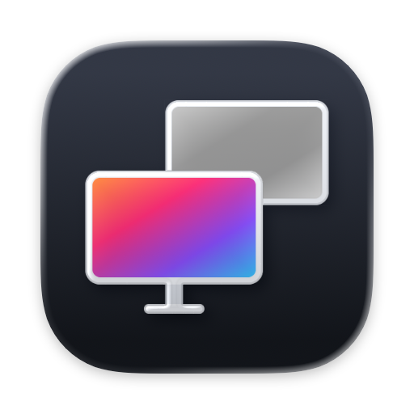

<p align="center">
  
</p>

<h1 align="center">Display Colour Filter</h1>

<p align="center">Turn macOS colour filters on or off for each display.</p>

macOS can apply colour filters — greyscale, colour-blindness filters and a colour tint — from **System Settings › Accessibility › Display**, but only to every display at once. Display Colour Filter is a small menu bar app that lets you decide, display by display, whether a filter is applied and which one.

For example, you can keep an external monitor in greyscale to cut down on distraction while the built-in display stays in full colour for design work.

## Features

- Turn the filter on or off for each connected display independently
- Choose a filter per display: Greyscale, Red/Green (Protanopia), Green/Red (Deuteranopia), Blue/Yellow (Tritanopia) or Colour Tint
- Adjust the intensity (and the hue for Colour Tint), using the same colour matrices as macOS itself
- Settings are remembered for each display
- Optionally open at login
- English and Japanese interface

## Requirements

- macOS 26 Tahoe or later
- A Mac with Apple silicon
- Displays driven directly by the Mac (built-in, USB-C / Thunderbolt, HDMI). Filters have no effect on virtual displays such as DisplayLink, AirPlay or Sidecar.

Tested on macOS 26.4 with a MacBook Air (M2) and an external USB-C display.

## Installation

1. Download [`DisplayColourFilter.dmg`](https://github.com/yotashiraishi/DisplayColourFilter/releases/latest/download/DisplayColourFilter.dmg) from the [latest release](https://github.com/yotashiraishi/DisplayColourFilter/releases/latest).
2. Open the disk image and drag **DisplayColourFilter** to **Applications**.
3. Open **DisplayColourFilter** from Applications.

The app is signed ad hoc but not notarised by Apple, so macOS blocks it the first time you open it:

1. When macOS says the app can’t be opened, click **Done**.
2. Open **System Settings › Privacy & Security**, scroll down to **Security** and click **Open Anyway** next to the message about DisplayColourFilter.
3. Confirm with your password or Touch ID, then click **Open Anyway** once more.

Alternatively, remove the quarantine flag in Terminal:

```sh
xattr -dr com.apple.quarantine /Applications/DisplayColourFilter.app
```

## Usage

Click the icon in the menu bar (three overlapping circles). For each display you can:

- switch the filter on or off
- choose the filter type
- adjust the intensity, and the hue for Colour Tint

Changes take effect immediately. The gear menu at the bottom right of the panel has **Open at Login** (start the app automatically when you log in), **About** and **Quit**.

Keep the system-wide colour filter (System Settings › Accessibility › Display › Colour filters) **turned off** while you use the app. If both are on, the system filter briefly appears on every display whenever macOS reapplies it.

Quitting the app removes its filters and returns every display to the system setting.

## How it works

macOS has no public API for applying a colour filter to a single display. The system applies its colour filters through a private WindowServer (SkyLight) function, `SLSSetAccessibilityAdjustments`, which takes a 3×3 colour matrix and, optionally, a target display. Display Colour Filter creates the matrices with the same MediaAccessibility functions that macOS uses, and sends one matrix per display.

macOS reapplies its own colour matrix to every display from time to time — for example when displays are reconfigured or accessibility settings change. The app listens for those events, and for wake from sleep, and reapplies its per-display matrices straight afterwards.

Because it depends on private APIs:

- a future macOS update may break it (the app shows a message if the functions it needs are missing)
- it can’t be distributed through the Mac App Store

## Building from source

Requires Xcode 26 (Swift 6.2 or later).

```sh
bash scripts/build-app.sh   # builds build/DisplayColourFilter.app
bash scripts/build-dmg.sh   # also packages dist/DisplayColourFilter.dmg
```

## Uninstalling

In the gear menu, turn off **Open at Login** if you enabled it and quit the app. Then move **DisplayColourFilter** from Applications to the Bin. Its settings are stored in `~/Library/Preferences/io.github.yotashiraishi.DisplayColourFilter.plist`.

## License

[MIT](LICENSE) © 2026 Yota Shiraishi

Display Colour Filter is not affiliated with or endorsed by Apple Inc.
